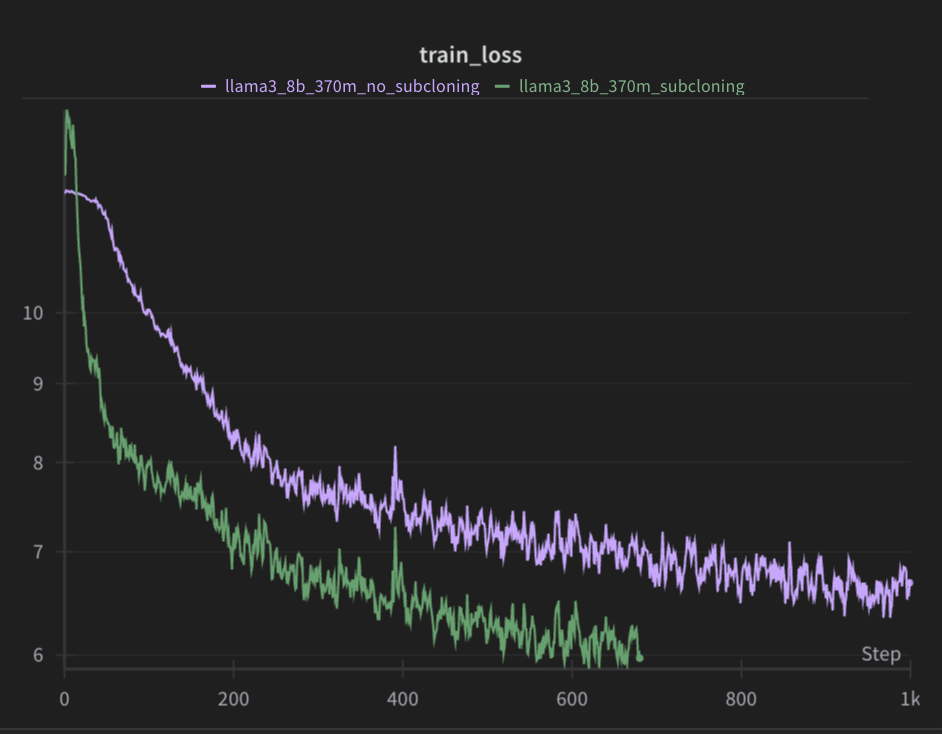

# Subcloning

Subcloning as referred in the paper https://arxiv.org/pdf/2312.09299, is an initialization technique that allows for the transfer of weights from a larger model to a smaller one. This technique is useful when you have a large model that you want to transfer to a smaller model, to achieve faster convergence and better performance.

In my project, I subcloned a llama8b model into a 370m parameter model. I utilized the fineweb datasets to train the subcloned model. 

Unfortunately, I don't have the time to research and extend this subcloning technique to general transformers at the moment. However, I have decided to release the subcloning method as it is, i'll release a gpt-2 variant that was done by keller.

Below is an image showing the convergence of training loss with and without subcloned weights:

